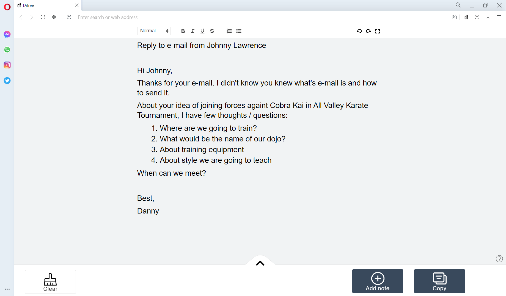
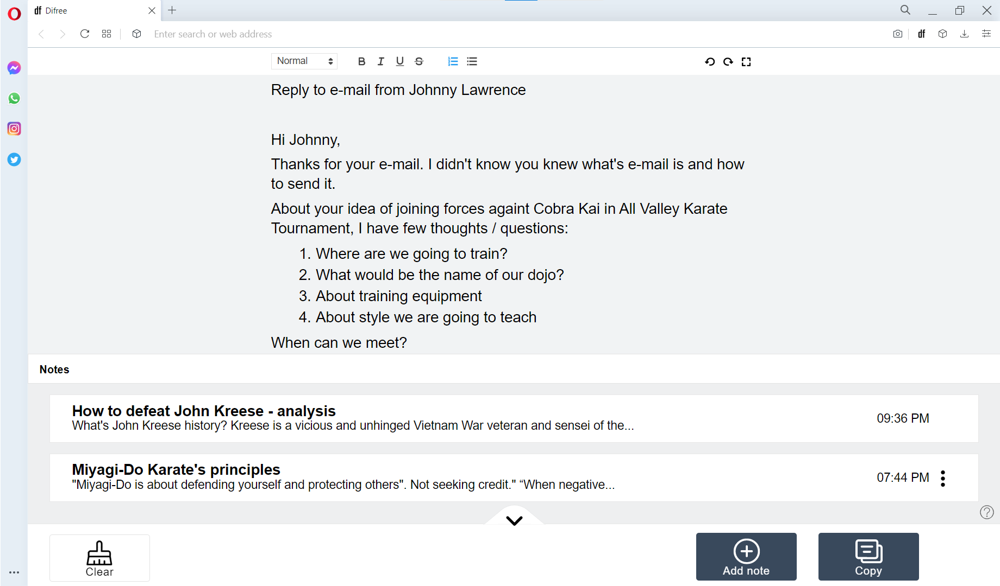
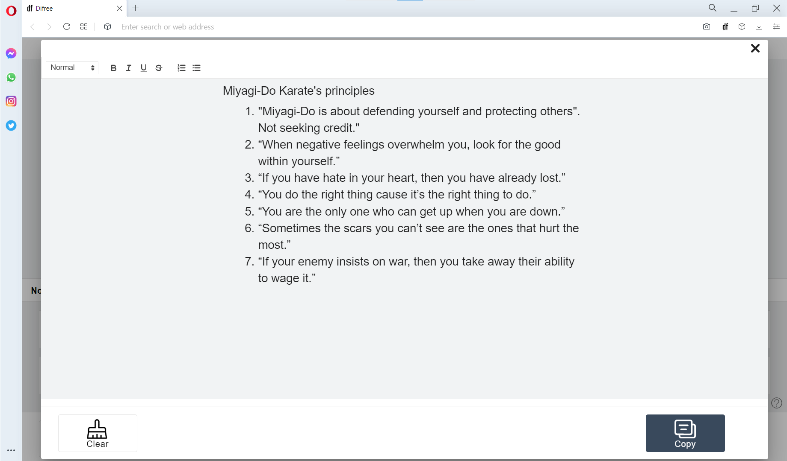

It’s over 6 weeks since our last release. We have been working on some major changes considering the logic of Difree.

When we started in July 2021, our goal was to create a safe, comfy and distraction free space for writing. We did it! Soon after that we noticed, we were often working on many things in the same time span. So we decided we want to create the editor covers working on more than one thing.

To make it happen, there was an issue to solve. How to keep Difree simple and focused on distraction free aspect and in the same moment let manage several things?

This is the moment to thank HEY – email provider from Basecamp. They inspired us with their solution – Imbox. Noap, it’s not a misspelling. HEY has a unique way to handle e-mails. Once you open it, you decide what to do with it (nothing, mark to reply later, set aside etc.). When you do nothing, the e-mail is automatically marked as seen and it’s hidden behind the curtain. Literally, because it looks like curtain. That was the solution we were looking for. We wanted notes in Difree to be:

1. hidden so they don’t distract
2. and easy accessable with a single click

With the new version, we implemented Toggle Peek
1. You can add your text to the Notes with a single click. (screenshot 1)
2. You can access your saved Notes with a single click. (screenshot 2 and screenshot 3)

* 
* 
* 