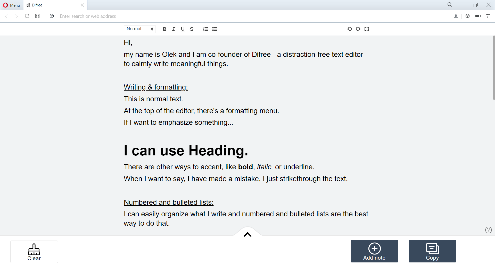
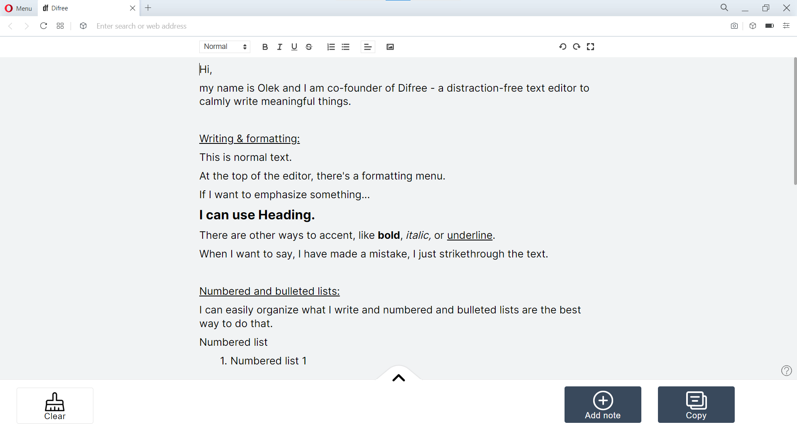

Hey,
We just released a new version of Difree (0.3.5) – our distraction-free text editor to calmly write meaningful things. The big deal is a new font. Here’s why.

## What’s changed?
For some, changing the font is not such a big deal. Overall, it’s just a font, am I right? For us, it is a big deal. Here’s why.
In Difree, the major component is distraction-free design and font. The rest is simply bells and whistles.
So far, we used Arial. Arial looked acceptable. I mean, Arial is a good font. It has a proven record of being fine. Many apps and websites use it. It cannot be bad.

But we wanted something different. We felt, Difree missed something. I mean, we tried to shape out the outlook, the buttons, the color palette. All those changes mattered to us. Yet still, the final effect was, we were missing something important, and we weren’t satisfied with the outcome.

Our goal was to choose a font, we would feel good when using it. It’s hard to describe the feeling, but let me try.
1. When I’m about to write something, I want to have the feeling of no obstacles and no hesitations.
2. When I’m writing, I would like to have the feeling I’m in the process of writing. There’s just me and the words coming out of my mind.
3. When I’m done writing and I glance at the text, I would like to have the feeling it looks elegant and readable. It fuels my feeling of no obstacles and hesitations, I mentioned in the beginning, so it keeps me motivated to write more.

Arial just wasn’t that type of font. In my opinion, [the font Inter](https://fonts.google.com/specimen/Inter#standard-styles) is this kind of font. That’s why we have changed it.

The Inter project is led by Rasmus Andersson, a Swedish maker–of–software living in San Francisco. To contribute, see [github.com/rsms/inter](http://github.com/rsms/inter)

We haven’t changed just a font style. We have made a whole package of changes considering font size and style, line height, letter spacing, paragraph spacing.

ust take a look and decide yourself. Or even better – try. 🙂

## Font type and style in previous version of Difree (0.3.4)

## Font type and style in current version of Difree (0.3.5)

## How to install / update

- Install extension in the browser: [https://i.getdifree.com/install](https://i.getdifree.com/install)
- Update extension to new version: the update should happen automatically when the browser runs. To check, enter Extension section in browser.

## Your feedback is crucial!

Please let us know how we are doing! Write on <hi@getdifree.com> or tooth [@getdifree](https://mastodon.world/@getdifree).

## Changelog

[See all the changes in Changelog](https://www.getdifree.com/changelog/)