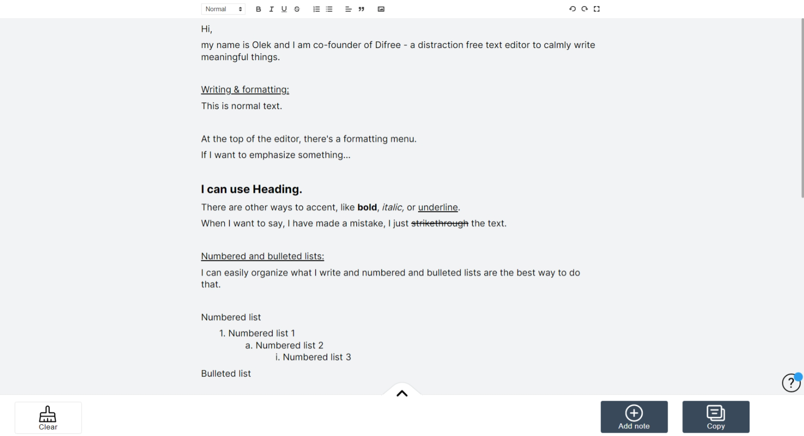

Hey Everyone,  
We have just released a new version of Difree – 0.4.0. Our main focus was to improve feedback loop in Difree.

## What’s changed?

Our main focus was to improve feedback loop in Difree. We would like to know more what you think about the extension.

1. After each major release (e.g., 0.3.5 → 0.4.0, or 0.8.9 → 1.0.0) we will show the blue dot on the Feedback icon indicating there’s something new in Difree.
2. When you click on the icon, the Feedback pop-up appears.
3. You can leave your feedback there. If you add your e-mail address, we will contact you back.

]
We hope, we can hear from you more and more often.

## How to install / update

- Install extension in the browser: [https://i.getdifree.com/install](https://i.getdifree.com/install)
- Update extension to new version: the update should happen automatically when the browser runs. To check, enter Extension section in browser.

## Your feedback is crucial!

Please let us know how we are doing! Write on <hi@getdifree.com> or tooth [@getdifree](https://mastodon.world/@getdifree).

## Changelog

See all the changes in Changelog](https://www.getdifree.com/changelog/)