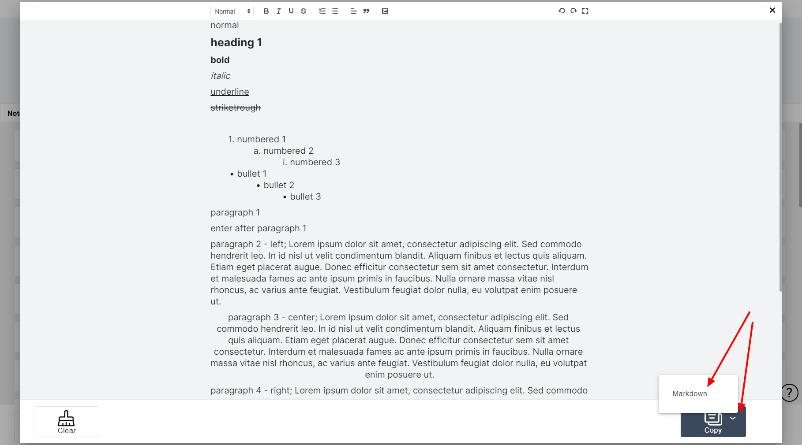
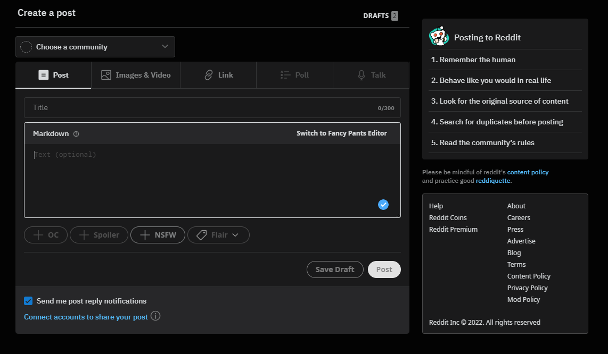
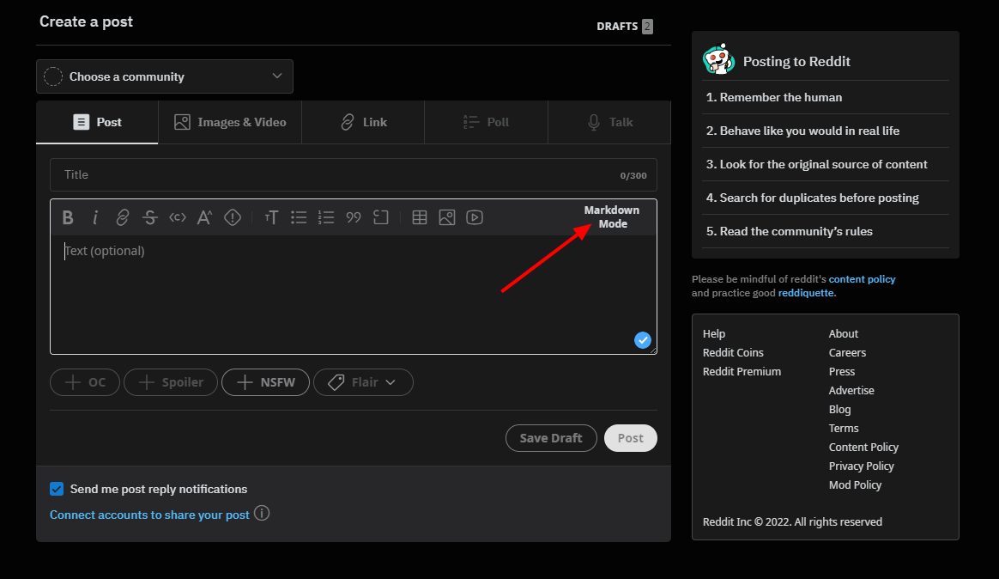

Hey Everyone,

We have just released a new version of Difree – 0.5.0 – our writing app focused on distraction-free experience when writing. We added an option to:1. export text in Markdown
2. export text in Plain text with some basic formatting

## What’s changed?

Our main focus was to add an option to:
1. export text in Markdown
2. export text in Plain text with some basic formatting

Why? We are the big fans of Reddit! And Reddit has a rather distraction-full text editor. We wanted to fix the experience we have with writing something longer and meaningful on Reddit.  

Here’s how it works:
1. Open Difree
2. Write a post / reply
3. Click a Menu option on Copy button and select ‘Markdown’ 
    
4. Paste in Reddit text field 
    
5. Remember to select ‘Markdown Editor’ first 
    

Tell us what you think!

## How to install / update

- Install extension in the browser: [https://i.getdifree.com/install](https://i.getdifree.com/install)
- Update extension to new version: the update should happen automatically when the browser runs. To check, enter Extension section in browser.

## We need your feedback

Let us know, please, how do you find this feature. We are waiting for You here, <hi@getdifree.com> and here [@getdifree](https://twitter.com/getdifree).## Changelog

[See all the changes in Changelog](https://www.getdifree.com/changelog/)