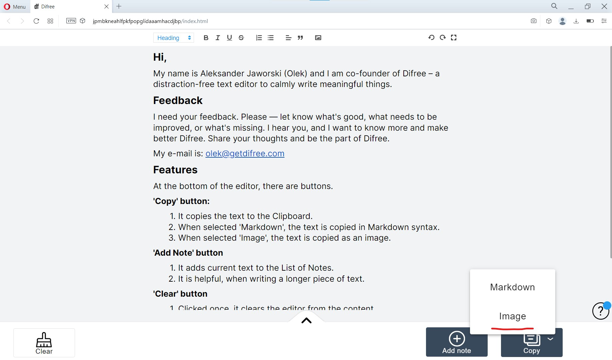
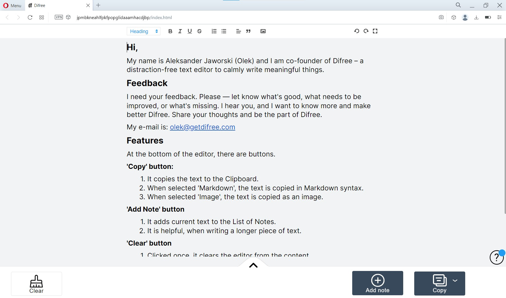
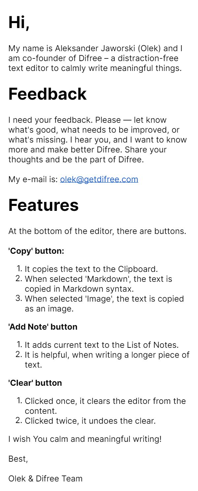

Hey Everyone,  
We have just released a new version of Difree – 0.6.0. It contains a change: option to copy text as an image to the Clipboard.

Here are the screenshots:
* Copy as image button
    * 
* The original text
    * 
* The image of the text
    * 

Tell us what you think!

## How to install / update

- Install extension in the browser: [https://i.getdifree.com/install](https://i.getdifree.com/install)
- Update extension to new version: the update should happen automatically when the browser runs. To check, enter Extension section in browser.

## We need your feedback

Please let us know how we are doing! Write on <hi@getdifree.com> or tooth [@getdifree](https://mastodon.world/@getdifree).

## Changelog

[See all the changes in Changelog](https://www.getdifree.com/changelog/)