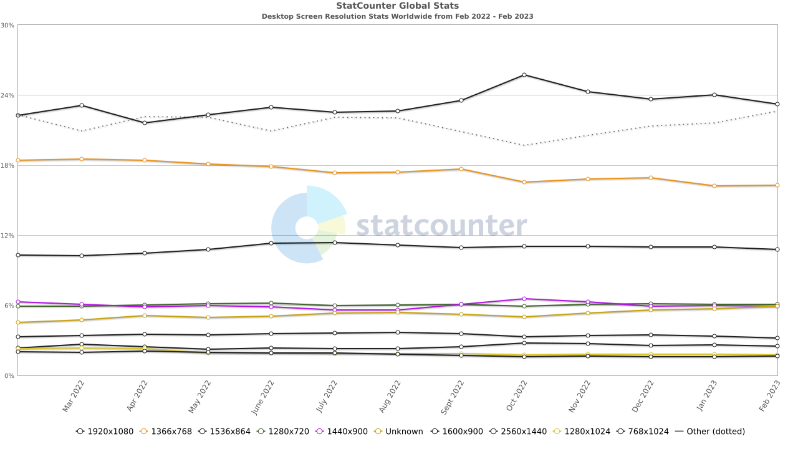
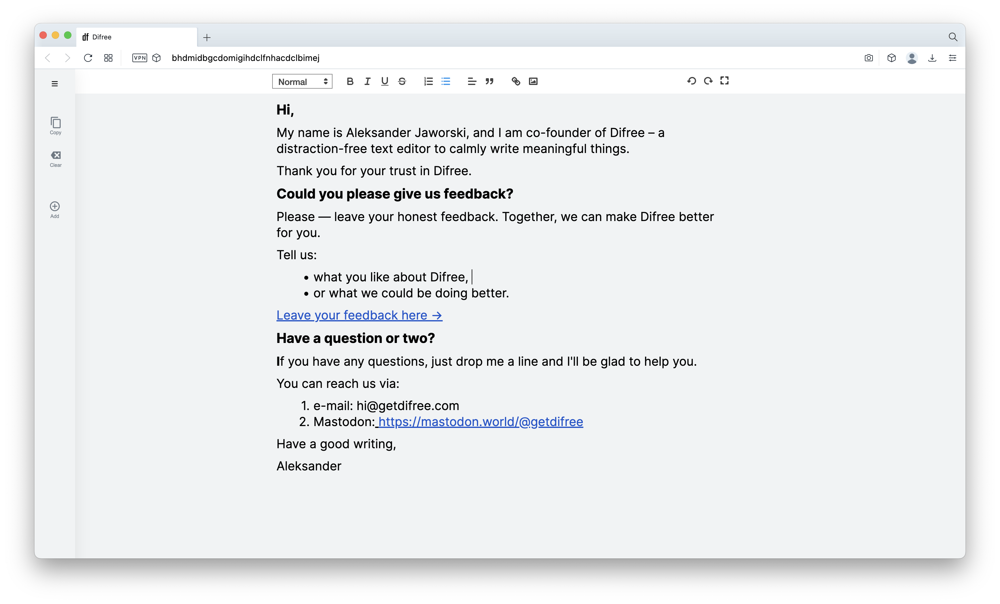
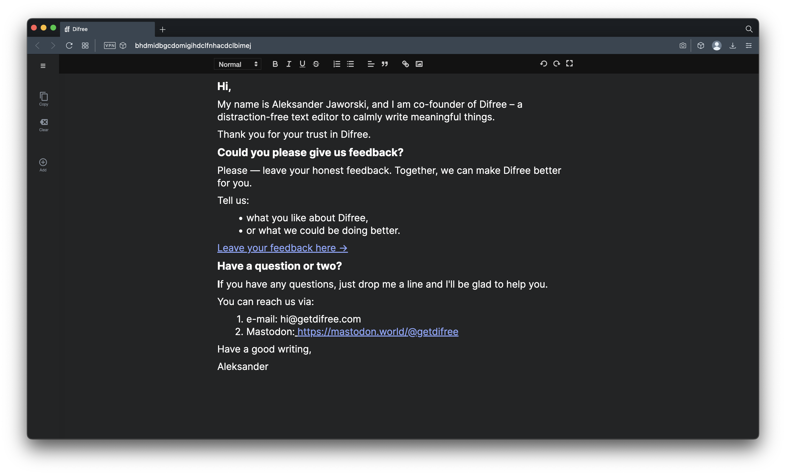

### Hey,

It’s been a while since we released a new version of Difree.  
There’s been a reason for that. We have been working on a different approach.

We designed Difree to have a bottom menu responsible for managing notes and for the actions, such as ‘copy’ or ‘clear’. It seemed to be a good idea at first…

…but most users use in their computers screens, that are 1.77 times wider than taller. According to the StatCounter, the most popular screen resolutions on desktop devices in the last 12 months are:

1. 1920×1080
2. 1366×768
3. 1536×864

This means people probably have fewer vertical space. Our previous design took some of that precious space.

We thought, what if we had moved that menu to the Sidebar? We would have saved some vertical space, which could have given more space for writing.

That has been our priority since the last release. And today we are ready to show off!

## How to install / update

- Install extension in the browser: [https://i.getdifree.com/install](https://i.getdifree.com/install)
- Update extension to new version: the update should happen automatically when the browser runs. To check, enter Extension section in browser.

## Your feedback is crucial!

Please let us know how we are doing! Write on [hi@getdifree.com](mailto:hi@getdifree.com) or tooth [@getdifree](https://mastodon.world/@getdifree). 

## Your reviews are what make us keep going!  
If you find Difree useful, could you please rate us ★★★★★ on [Chrome Web Store](https://i.getdifree.com/review-chrome), or [Firefox Add-ons](https://i.getdifree.com/review-firefox)?

### Fancy for a sneak-peek?

We are not slowing down with our work and immediately started working on dark theme. We are aware, there are die-hard lovers of that.

Stay tuned for more information about it!

If you want to give us feedback, just drop us a line.

